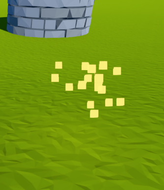
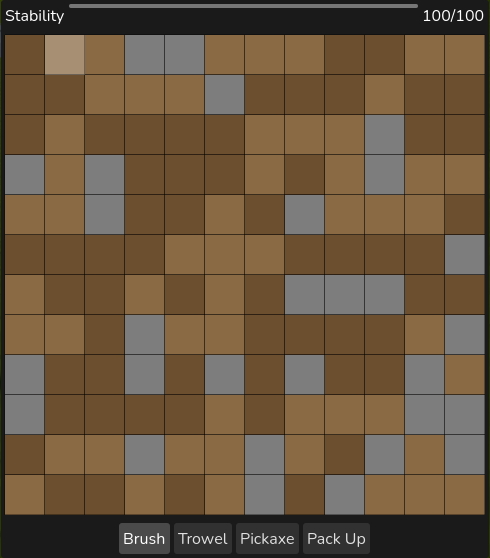
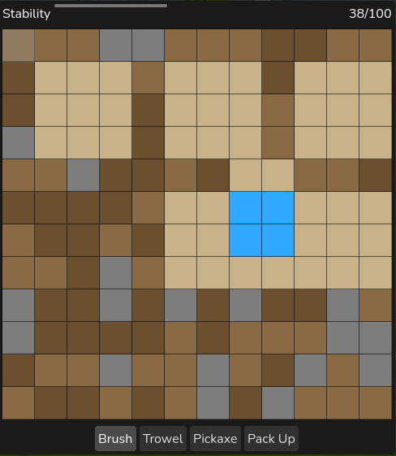
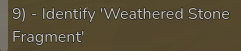
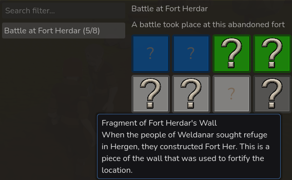
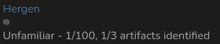

Archeology! Excavate artifacts, discover their origin and learn about the history of the world. It's a new skill that is finally available (designed back in 2022!) in the latest Alpha builds. Want to test it yourself? Become a playtester! (Just send me a message on the official discord~)

## Artifacts

The core gameplay loop of the archeology skill is finding artifacts throughout the world of Erios. Artifacts can be found at specific zones where a historic event took place. For instance: Fort Herdar. Fort Herdar is an old abandoned fort that has fallen into decay for more than a hundred years. Most of what had happened here is forgotten to time, yet forgotten artifacts of this place still linger.

If you interact with it, then you will start a digsite and begin to excavate for the artifact. They are buried beneath the ground, and need to be retrieved carefully before the **stability** meter runs out. You start with 100 stability, but as you progress through the skill, you will have a larger stability range.

There's layers of soil and stone, and you have 3 items at your disposal:
- Brush, removes 1 1x1 layer, -1 stability
- Trowel, removes 3 1x1 layers, -2 stability
- Pickaxe, removes 3 3x3 layers, -10 stability.

Yet don't be fooled by the pickaxe, as it's large. If it hits an artifact, then that's -5 stability per artifact square you hit! Artifacts have a blue color, and once fully retrieved, they will be added to your inventory.
 

Find all artifacts of one historic event, and you will be able to learn the full story of what happened at the historic event.

## Discovery

So, you found an artifact. Now what? What is it? Well, to find that out, you will need to find a NPC that has knowledge over historic artifacts. Artifacts belong to a specific culture, such as Hergen or Helm. Both significant cultures that you don't know much about, but that is the fun part about archeology! You find something unknown, and you will learn what it is. So the same happens with this skill.

Undiscovered artifacts have obscure names, such as "Weathered Stone Fragment". Yet if you find a NPC with archeology knowledge in the culture this item belongs to, then they might be able to identify the item.

The item was identified as a "Fragment of Fort Herdar's Wall"

*Each artifact will also have a 3D model, so in the demo there won't be ? icons anymore*

But what exactly happened at Fort Herdar? Well, find all 8 artifacts and you will learn about the full story. Each artifact also tells a bit about the event as well.

## Knowledge

So in archeology you acquire artifacts that you can identify, yet you also acquire knowledge about a culture.

If your knowledge level of a culture is high enough, then you will be able to automatically identify artifacts, since you are able to recognize due to the cultural knowledge. Which artifacts you can identify, depends on their rarity level. A rare artifact requires 40 knowledge, whereas a common artifact only requires 10 knowledge.

> These numbers might change in the future. Balance~ Future~ Wooo~

## Progression

Archeology has multiple ways of progression:
1. Leveling up the archeology skill for more stability points at the digsite minigame
2. Completing historic events to learn more about the history of the world
3. Acquiring knowledge of cultures to be able to automatically identify artifacts

Completing the digsite minigame grants archeology experience. Identifying a new artifact grants knowledge experience.

And yes, there are achievements as well!

## Message from the developer

Normally I'd just show a few screenshots, and move on. So I hope you like this more in-depth breakdown of a skill. I am now at 4/16 skills, so 25% of the skills done in 2 years. Yet skills didn't have much of a priority, hence it took 2 years to do 4. Well, they are currently the priority! For the oncoming weeks I will focus on adding more skills.

I hope you enjoyed this skillfully written blog, and I will see you at the next skill blog!

- Lithrun